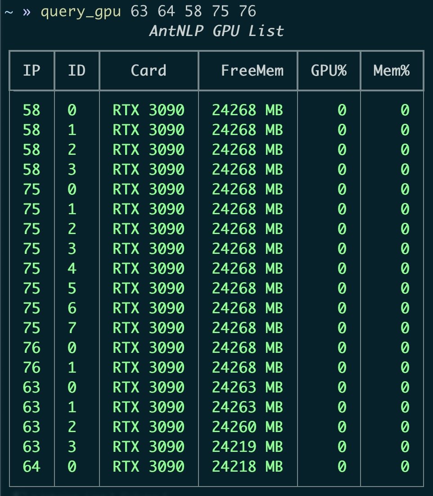

# Tool: Query GPU Server

查询多台服务器的显卡使用情况，示例：



列名    | 含义
:-------| :--- 
IP      | 服务器IP别名
ID      | GPU ID (0, 1, 2, ...)
Card    | 显卡名称
FreeMem | 空闲显存 MB (降序排序关键字)
GPU%    | GPU 当前算力占用百分比
Mem%    | GPU 当前显存占用百分比


## 安装方式

### Step0: 克隆本仓库并进入当前工具文件夹

```shell
git clone https://github.com/AntNLP/research-tools.git
cd research-tools/query-gpu
```

### Step1: 检查 `python` 版本并安装辅助工具包

```shell
python --version  # >= 3.6.12
pip install rich>=11.2.0
```

### Step2: 设置 ssh 服务器免密登录并设置别名

免密登录设置参考：👉🏻 https://www.cnblogs.com/jhao/p/12917598.html

设置别名，例如设置 `66` 为 `abc@123.123.123.66` 的别名，设置 `88` 为 `xyz@123.123.123.88` 的别名：

```shell
vim ~/.ssh/config

~/.ssh/config
Host 66
     HostName 123.123.123.66
     User abc
     Port 22

Host 88
     HostName 123.123.123.88
     User xyz
     Port 22
```


### Step3: 复制命令并执行

对于 Linux/Mac OS 用户，

```shell
sudo cp query_gpu* /usr/local/bin/
sudo chmod 755 query_gpu*
query_gpu 66 88
```
